# **RISCC IT framework**

[RISC Mobile App](#risc-mobile-app)

[Admin Application](#admin-application)

[Main functionalities](#main-functionalities)

[Menu option “Question”](#menu-option-“question”)

[Admin application test environment](#admin-application-test-environment)

[Mobile App](#mobile-app)

[Main functionalities](#main-functionalities-1)

[Create a participant account](#create-a-participant-account)

[App bottom menu](#app-bottom-menu)

[App main menu](#app-main-menu)

[Risk calculation in the RISCC mobile platform](#risk-calculation-in-the-riscc-mobile-platform)

[Risk assessment in the mobile app](#risk-assessment-in-the-mobile-app)

[How do I implement the source code?](#how-do-i-implement-the-source-code?)

[Deploying the backend](#deploying-the-backend)

[Deploying an iOS App](#deploying-an-ios-app)

[1\. Prepare Your App for Release](#1.-prepare-your-app-for-release)

[2\. Create an Apple Developer Account](#2.-create-an-apple-developer-account)

[3\. Set Up App Store Connect](#3.-set-up-app-store-connect)

[4\. Configure Certificates and Profiles](#4.-configure-certificates-and-profiles)

[5\. Create App Store Listing](#5.-create-app-store-listing)

[6\. Generate Release Build](#6.-generate-release-build)

[In Xcode:](#in-xcode:)

[7\. Submit to App Store](#7.-submit-to-app-store)

[8\. Submit for Review](#8.-submit-for-review)

[9\. Manage Your App](#9.-manage-your-app)

[Alternative Distribution Methods](#alternative-distribution-methods)

[Deploying an Android App](#deploying-an-android-app)

[1\. Prepare Your App for Release](#1.-prepare-your-app-for-release-1)

[2\. Generate a Release Build](#2.-generate-a-release-build)

[3\. Test Your Release Build](#3.-test-your-release-build)

[4\. Create a Google Play Developer Account](#4.-create-a-google-play-developer-account)

[5\. Set Up Your Google Play Console](#5.-set-up-your-google-play-console)

[6\. Upload Your App](#6.-upload-your-app)

[7\. Manage Your App](#7.-manage-your-app)

[Alternative Distribution Methods](#alternative-distribution-methods-1)

[Vaccination Platform](#vaccination-platform)

[Vaccination Admin application](#vaccination-admin-application)

[Main functionalities](#main-functionalities-2)

[Vaccination Participant application](#vaccination-participant-application)

[Main functionalities](#main-functionalities-3)

[GitHub Repository](#github-repository)

# **RISC Mobile App**  {#risc-mobile-app}

The RISCC mobile platform enables screening programs to collect risk factors and other information from study participants through questionnaires. Participants use a mobile app to answer questions, learn about the study and communicate with the study managers.

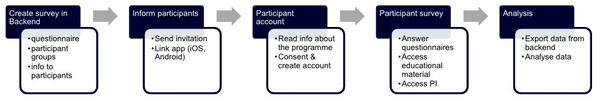

## **Admin Application** {#admin-application}

This is a web application to be used by the study PI, researchers, and managers. 

### **Main functionalities** {#main-functionalities}

* Create a list of allowed users participating in the study or studies. That way, even though anyone can download the RISCC app on their mobile device, only allowed users can create an account.  
* Create groups of participants that will receive different questionnaires based on selection criteria.  
* Create questionnaires and assign them to the groups of participants  
* Provide risk value to each question for personal risk calculation based on answers to questionnaires  
* Manage users and answers from users  
* Download answers as CSV to be analysed with RISCC analysis tools

### **Menu option “Question”** {#menu-option-“question”}

**Create questionnaire:** Several questionnaires can be created, and questions can be in several questionnaires.  
**Add questions to the questionnaire:**  Questions can be added interactively through the user interface (UI) or by importing an Excel file based on the provided template.  
 

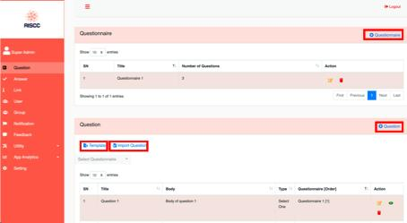

   
**Creating a question in the UI**  
   
A question belongs to a “Questionnaire” and has an order in that questionnaire. In figure 2, the questionnaire is “Questionnaire 1” and appears as the fourth question in the app, the title is “Question 4”, and the body is “Body of question 4”. The question has two options, and you can select only one (“Yes” or “No”).  
   
The participant can receive an email with a text defined for the option depending on the answer. In the example below, the participant selecting this option receives an email with the following text: “Please, contact the Study Medical Office: \+46123123123”. This is very useful when the questionnaire is, for instance, a health declaration that detect a critical issue that needs attention.  
   
The same question can be in several questionnaires in different orders.  
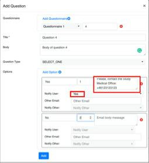
   
When questions are imported using the template, adjustments must be made to each question, such as the message for notifying the participant by email, depending on the answer.  
   
**Menu option “Answer”**  
This option shows the answers from the participants.  
All the answers from a defined period can be exported. Answers can also be filtered by questionnaire and user. The filter result can be exported as CSV or PDF, and columns from the table can be filtered out to show or export what is needed.  
   
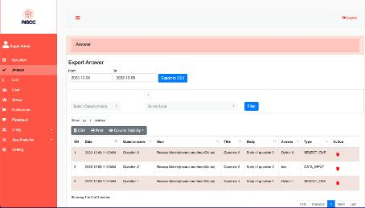
   
**Menu option “Link”**  
   
This option allows adding relevant links that will be available to the participants in the app.  
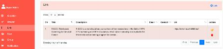
In the app, the participant can access the link:  
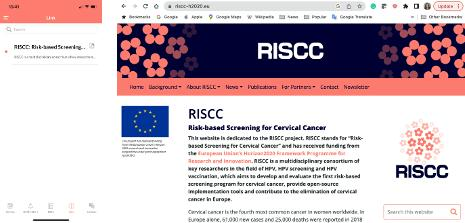
 

**Menu option “User”**  
   
The User window shows all the users in the database. The users can have different roles that can be customised in another menu option. By default, the system provides *Admin* and *Participant* roles. All the user accounts created by the participants from the mobile app are assigned the role “Participant”.  
   
In the window “User”, the Admin role can create other users.  
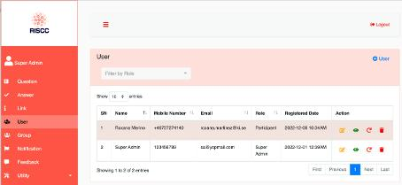

Four actions can be done with the users:

**Edit**: Edit the user information  
**More info**: Shows user information  
**Delete answer**: delete all the answers from the user  
**Delete**: Delete the user from the database, but only before the answers are deleted  
   
**Menu option “Group”**  
   
This option allows the creation of groups of participants that can be assigned different questionnaires.  
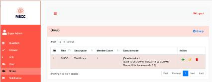
   
When a group is created, the admin role provides the group name, adds the questionnaires for the group, sets the activation time for each questionnaire, sets the remainder text that will appear in the app, and sets the interval time for reminders.  
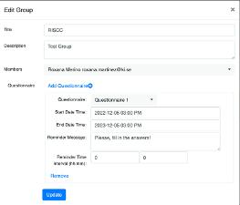
   
**Menu option “Notification”**  
   
This option allows the admin role to create and send notifications to the participants. The app receives the notifications if notifications are enabled for the RISCC app on the participant's mobile device.  
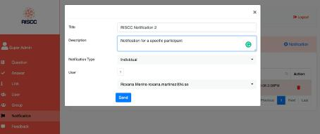
   
The notifications can be sent Broadcast, Role, Group, and Individual.  
   
Menu option “Feedback”  
   
This option allows the admin role to see participant feedback, capturing the date, the participant info, and the participant’s mobile device.  
   
Feedback from the mobile device:  

Feedback shown in the backend  
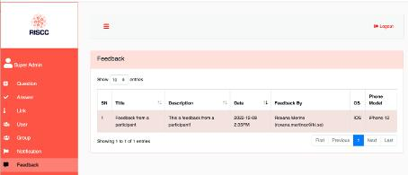
   
**Menu option “Utility”/Allowed Registration”**  
   
The relevant function of the " Utility option "is “Allowed Registration.” This feature allows anyone to download the app from AppStore or Google Play, but only those whose emails are registered in the system can create user accounts from the mobile app.  
The allowed emails can be added through the UI (“+Allowed Registration”) or by importing a list using the template.  

**Menu option “Setting”**  
   
The relevant functions in the settings windows are setting the Project Responsible information, the welcome and thanks texts, and a PDF file with the information for the participants that will be shown in the app.  
   
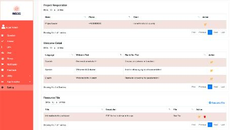

### **Admin application test environment** {#admin-application-test-environment}

[https://riscc-vaccination.org](https://riscc-vaccination.org) 

# **Mobile App** {#mobile-app}

This app is to be used by the study participant in basically any study or screening program. In principle, once the app is deployed in AppStore and Google Play, any person can download the app and install it in her mobile device. However, to be able to create an account, the participant must be authorised by the admin role. It has been explained in the backend functionalities.  
The governance system established for the study or screening program should take care of inviting the participants and updating the allowed participant list in the backend system.

Before creating the account, the participant must consent to the study or screening program. The study and consent information is uploaded in the backend (as a PDF) and shown in the app. For example, we provide a template in English, Spanish, and Swedish to be modified.  
   
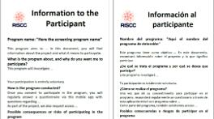

## **Main functionalities** {#main-functionalities-1}

* Consent participation (Consent document (PDF) can be uploaded into the admin application)  
* Fill questionnaires  
* Get notifications from the admin application regarding questionnaires, news about the study, etc.  
* Access links to relevant info about the program

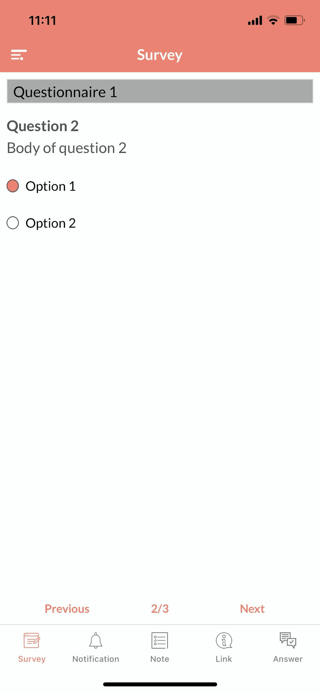
automatically generated")

## **Create a participant account** {#create-a-participant-account}

Once the app is installed on the mobile device and the user has consented to participate, a screen for signing up is presented. The participant fills the user information and agrees with the “Terms of Service”.

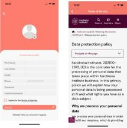

When the user signs up, if the phone number has been correctly provided, a code is sent to the phone to create the account.  
Once the account is created, the user can log in, and the default questionnaire is presented.  
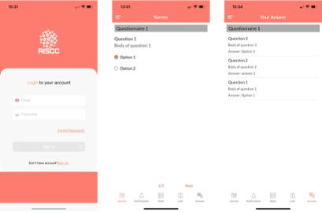

The participant can fill the questionnaire and see the answer to the questions clicking “Answer” icon.  
 

### **App bottom menu** {#app-bottom-menu}

### **App main menu** {#app-main-menu}

   
The upper left icon opens the app's main menu.  

   
Through this menu, the participant accesses the functions in the bottom menu and other functions as:  
**Edit Profile:** Update the user info  
**Feedback:** Send feedback to the admin role  
**Contact Us:** Set in contact with the study or program manager defined in the backend  
**Privacy Policy:** Access the same “Terms of Service” provided when the account was created  
**About:** Info about the app  
**Change Password:** Change user password after providing the old password  
**Log Out:** Log out the app

## **Risk calculation in the RISCC mobile platform** {#risk-calculation-in-the-riscc-mobile-platform}

The RISCC mobile platform was developed as generic software to enable different use cases in a screening program. For instance, the same mobile platform can be used to gather information from participants in a vaccination campaign, help decide the target population for HPV screening or research studies, warn participants about visiting a clinician, or educate participants about the program, for instance, on how to use the self-sampling kit or where to access information about cervical cancer prevention and treatment.

In addition to the questionnaire and user management, the back-end application provides the functionalities to calculate risk based on questionnaire answers. The number and content of the questions are flexible. However, the questionnaire designers must know the aim of each question and how the answers contribute to the risk calculated.

Each question has a risk value. The total risk is calculated by summing up all the values from the questions. The values are positive and can be zero.

For instance, Figure 1 shows option 1 of question 2 of the “HPV-screening \#1” questionnaire. The same question can have one or several optional answers. Each answer has a risk value. The sum of all risk values constitutes the risk generated from that particular question. A questionnaire can have several questions, each with its associated risk value.

This means all the questions (and options per question) are related and must be carefully designed.

Table 1\. Example of a questionnaire with risk-stratification to select target population for screening (20 \< Age \< 35, not HPV test in the last 5 years, or the test result was positive or unknown). The questionnaire has two questions to select one option from each, each with an associated risk value.

| Question | Question text | Option | Options | Risk value |
| :---- | :---- | :---- | :---- | :---- |
| 1 | Select your age range | 1 | Age \< 20 | 0 |
| 1 | Select your age range | 2 | 20 \< Age \< 35 | 20 |
| 1 | Select your age range | 3 | Age \> 35 | 0 |
| 2 | If you had Human Papillomavirus (HPV) test less than 5 years ago, what was the result? | 1 | I did not take an HPV test in the last 5 years | 10 |
| 2 | If you had Human Papillomavirus (HPV) test less than 5 years ago, what was the result? | 2 | I don’t know the result | 5 |
| 2 | If you had Human Papillomavirus (HPV) test less than 5 years ago, what was the result? | 3 | Negative | 1 |
| 2 | If you had Human Papillomavirus (HPV) test less than 5 years ago, what was the result? | 4 | Positive, but I do not know for which virus. | 8 |
| 2 | If you had Human Papillomavirus (HPV) test less than 5 years ago, what was the result? | 5 | Positive for HPV16 | 9 |
| 2 | If you had Human Papillomavirus (HPV) test less than 5 years ago, what was the result? | 6 | Positive for HPV18 | 9 |
| 2 | If you had Human Papillomavirus (HPV) test less than 5 years ago, what was the result? | 7 | Positive for some other HPV type, but I do not know which one. | 7 |

 

The total risk is internally calculated for each participant when they answer the questions from the app. The total value is the sum of all risk values from the selected options. For instance, if a participant selects “Age\<20” from question 1 and “I did not take HPV test in the last 5 years” from question 2, the risk value will be 10\.

Note: The example above aims to illustrate how to use the system; it is not an actual questionnaire with real risks derived from mathematical models, heuristics or well-established knowledge.

Once each question and its answer options have been assigned a risk value, the range values of the risk must be provided with their respective actions. This is done in the menu option “Settings,” section “RISCC range value,” where as many range values as needed can be added.  

Establishing the range of values for a risk, the message to be shown in the participant App, and the link to more information about the measure to take regarding the risk.  

Based on the answers, three ranges were added to inform the participant about what to do.

#  

## **Risk assessment in the mobile app** {#risk-assessment-in-the-mobile-app}

This section provides the workflow for answering a questionnaire and getting the risk assessment in the app.

1\. 	Open the app RISCC.

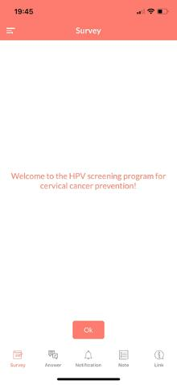

2\. 	Answer the questionnaire.

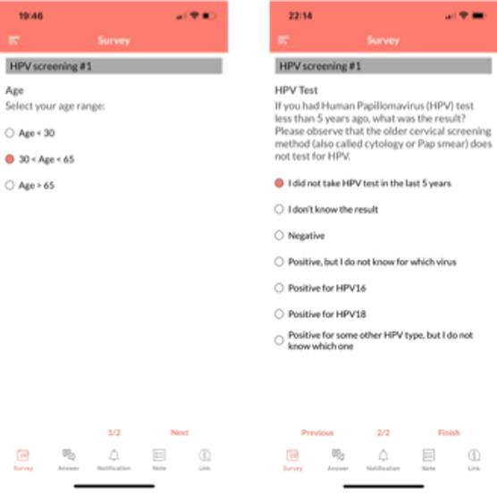
3\. 	Get the risk assessment according to the answered questions.

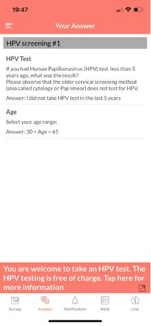

4\. 	Go to the link added to the risk range.

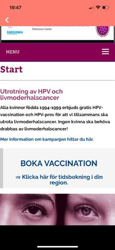

The above is just an illustrative example of how to use the platform's risk assessment functionality. It is essential to consider that the design of the questionnaires and the assignment of risk values require a good knowledge of the subject and previous data modelling to determine the risk factors and how to mitigate them.

The design of the questions should be done with the following in mind: the questions are sequential (no bifurcations), and the type of questions managed by the system (select one option, select multiple options, rating, data input, only information).

## **How do I implement the source code?** {#how-do-i-implement-the-source-code?}

Although the mobile platform is in Beta, it is entirely functional and can be easily customised. The RISCC software repository is openly available. Any RISCC member or researcher interested in contributing or acquiring the code can access the backend and mobile app (iOS and Android) in this repository.

### **Deploying the backend** {#deploying-the-backend}

1. Alocate a web server   
2. Deploy code from GitHub  
3. Configuration file (server address, etc.)

   # **Deploying an iOS App** {#deploying-an-ios-app}

Here's a step-by-step guide to deploy your iOS application:

## **1\. Prepare Your App for Release** {#1.-prepare-your-app-for-release}

* Complete final testing: Test on different iOS devices and versions  
* Update version and build numbers: In Xcode, update CFBundleVersion and CFBundleShortVersionString  
* Configure app icons and launch screens: Ensure all required sizes are included  
* Check app permissions: Review and validate all permission requests

  ## **2\. Create an Apple Developer Account** {#2.-create-an-apple-developer-account}

* Sign up at [developer.apple.com](https://developer.apple.com)  
* Pay the annual fee ($99 for individuals, $299 for organisations)  
* Complete the enrollment process

  ## **3\. Set Up App Store Connect** {#3.-set-up-app-store-connect}

* Log in to [appstoreconnect.apple.com](https://appstoreconnect.apple.com)  
* Create a new app listing (+ button → New App)  
* Enter your app's basic information (name, primary language, bundle ID, SKU)

  ## **4\. Configure Certificates and Profiles** {#4.-configure-certificates-and-profiles}

**In Xcode:**

1. Go to Xcode → Preferences → Accounts  
2. Add your Apple Developer account  
3. Manage Certificates to create/download necessary certificates  
4. Set up provisioning profiles

   ## **5\. Create App Store Listing** {#5.-create-app-store-listing}

* Add app description, keywords, and category  
* Upload screenshots (required for all supported device sizes)  
* Add app preview videos (optional)  
* Enter privacy policy URL  
* Configure pricing and availability

  ## **6\. Generate Release Build** {#6.-generate-release-build}

# **In Xcode:** {#in-xcode:}

1. Select Generic iOS Device as the build target  
2. Set build configuration to Release  
3. Go to Product → Archive  
4. Once archiving completes, the Organizer window will open

   ## **7\. Submit to App Store** {#7.-submit-to-app-store}

**From the Xcode Organizer:**

1. Select your archive  
2. Click "Distribute App"  
3. Select "App Store Connect"  
4. Follow the distribution wizard  
5. Upload the build to App Store Connect

   ## **8\. Submit for Review** {#8.-submit-for-review}

**In App Store Connect:**

1. Select your app and the uploaded build  
2. Complete App Review Information section  
3. Answer content rights questions  
4. Provide demo account if needed  
5. Submit for Review

   ## **9\. Manage Your App** {#9.-manage-your-app}

* Monitor crash reports  
* Respond to user reviews  
* Release updates as needed

  ## **Alternative Distribution Methods** {#alternative-distribution-methods}

* TestFlight: For beta testing before official release  
* Ad Hoc distribution: For limited distribution to registered devices  
* Enterprise distribution: Via Apple Developer Enterprise Program (separate $299/year)  
* In-house apps: Custom B2B apps through Apple Business Manager

The App Store review process typically takes 1-3 days but can vary based on app complexity and the review queue.

# **Deploying an Android App** {#deploying-an-android-app}

Here's a step-by-step guide to deploy your Android application:

## **1\. Prepare Your App for Release** {#1.-prepare-your-app-for-release-1}

* **Complete final testing**: Test thoroughly on different devices  
* **Update version information**: In build.gradle, set versionCode and versionName  
* **Configure ProGuard** (if using): Finalize your obfuscation rules  
* **Create a signed release APK/Bundle**:  
  * Generate a signing key if you don't have one  
  * Configure app signing in Android Studio

  ## **2\. Generate a Release Build** {#2.-generate-a-release-build}

In Android Studio:

1. Go to Build → Generate Signed Bundle/APK  
2. Select Android App Bundle (recommended) or APK  
3. Configure/select your keystore and key  
4. Choose release build variant  
5. Complete the wizard

Via command line:

Copy  
./gradlew bundleRelease

or

Copy  
./gradlew assembleRelease

## **3\. Test Your Release Build** {#3.-test-your-release-build}

* Install the release version on test devices  
* Verify that all features work correctly  
* Check for any performance issues

  ## **4\. Create a Google Play Developer Account** {#4.-create-a-google-play-developer-account}

* Sign up at [play.google.com/apps/publish](https://play.google.com/apps/publish)  
* Pay the one-time $25 registration fee

  ## **5\. Set Up Your Google Play Console** {#5.-set-up-your-google-play-console}

* Create your app listing  
* Fill in store details (descriptions, screenshots, feature graphic)  
* Set up pricing and distribution countries  
* Configure content rating

  ## **6\. Upload Your App** {#6.-upload-your-app}

* Upload your signed AAB/APK  
* Set up an internal test, closed test, or open test  
* Create a production release when ready

  ## **7\. Manage Your App** {#7.-manage-your-app}

* Monitor crashes and ANRs  
* Respond to user reviews  
* Release updates as needed

  ## **Alternative Distribution Methods** {#alternative-distribution-methods-1}

* **Direct APK distribution**: Share via your website or email  
* **Alternative app stores**: Amazon Appstore, Samsung Galaxy Store, Huawei AppGallery  
* **Enterprise deployment**: Use Mobile Device Management (MDM) solutions

# **Vaccination Platform** {#vaccination-platform}

The vaccination platform enables vaccination centres to collect risk factors and other information from the study participants before vaccination. It can also register vaccination information and prevent vaccinating participants from being exposed to risks due to the vaccination. This platform can be customised for different use cases and other languages.

It has two main components: **Admin** and **Participant** applications. Both are web applications.

# **Vaccination Admin application**  {#vaccination-admin-application}

To be used by nurses and midwives.

### **Main functionalities** {#main-functionalities-2}

* Admin: create nurses' accounts, export data, create questionnaires, groups of participants associated to questionnaires   
* Nurses read the questionnaire’s answers before vaccinating the participant, vaccinating and updating info, exporting data, and editing existing records.

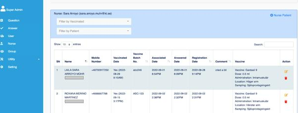

## **Vaccination Participant application** {#vaccination-participant-application}

To be used by the study participant

### **Main functionalities** {#main-functionalities-3}

* Consent participation  
* Login with e-identification (or classic username, password)  
* Answer questionnaire  
* Revise vaccination history

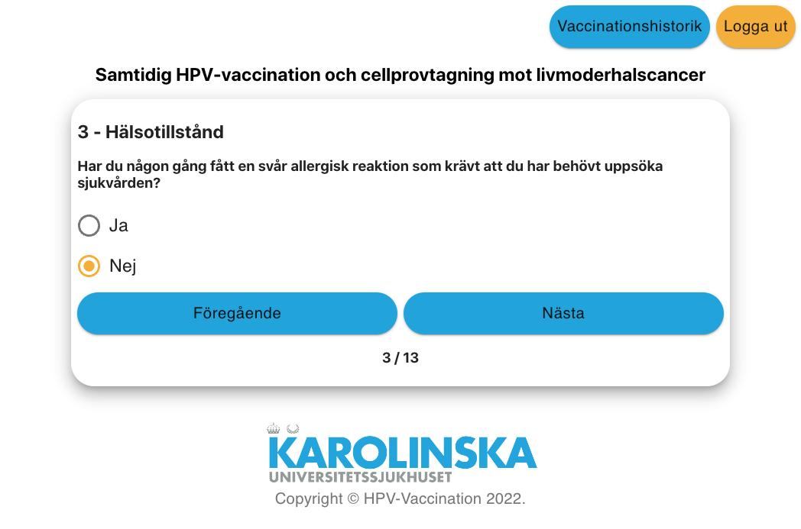

# **GitHub Repository** {#github-repository}

[https://github.com/kiehealth/RISCC](https://github.com/kiehealth/RISCC) 

